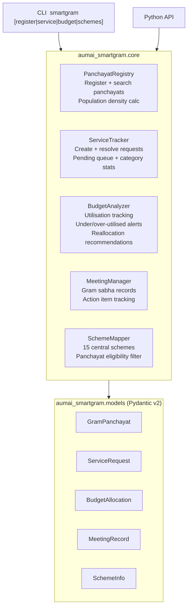

# aumai-smartgram

> **SmartGram** (स्मार्टग्राम) — AI assistant for India's gram panchayats. Manage village governance, track service requests, analyse scheme budgets, record gram sabha meetings, and discover eligible central government programmes.

[](https://github.com/aumai/aumai-smartgram/actions)
[](https://www.python.org/downloads/)
[](LICENSE)

---

> **GOVERNANCE DISCLAIMER:** aumai-smartgram provides AI-assisted analysis and information tools only. It does NOT constitute official Panchayati Raj guidance. All decisions must follow the Panchayati Raj Acts of the respective state, official e-Gram Swaraj guidelines, and proper administrative approval channels. This tool does not replace elected panchayat representatives, Block Development Officers, or District Collectors. Any outputs must be verified with authorised officials before being acted upon.

---

## What is aumai-smartgram?

India has over 2.5 lakh gram panchayats governing more than 800 million rural residents. Each panchayat manages infrastructure, welfare delivery, scheme funds, and citizen services — often with minimal administrative support.

Imagine a gram panchayat secretary juggling MGNREGA muster rolls, PMGSY road complaints, PMAY housing lists, mid-day meal reports, and a gram sabha agenda — all in the same week, often without digital tools.

aumai-smartgram is the digital backbone for that panchayat. Think of it as a lightweight, offline-capable governance toolkit that:

- **Registers and profiles panchayats** with demographic and geographic data
- **Tracks citizen service requests** by category (infrastructure, health, water, roads, etc.) with priority queues and resolution rates
- **Analyses scheme budget utilisation** to flag under-spent funds before the financial year ends
- **Records gram sabha meetings** with agenda, decisions, and action items
- **Maps eligible central government schemes** to any panchayat's profile

It is designed to work as a Python library embedded in larger applications, as a CLI tool for panchayat data entry, or as a data layer in district-level dashboards.

## Why does this matter?

Two of the biggest governance challenges at the panchayat level are:

1. **Scheme fund lapse:** Panchayats lose funds by failing to utilise allocated budgets before the financial year deadline. The budget analyser flags under-utilised schemes (< 50% utilisation) and recommends reallocation before funds lapse.

2. **Scheme blindness:** Many eligible panchayats do not apply for programmes they qualify for because the mapping from panchayat characteristics to scheme eligibility is not systematised. The scheme mapper covers 15 central schemes across Rural Development, Education, Health, Agriculture, and Water.

aumai-smartgram directly addresses both problems with a small, auditable, typed Python library.

## Architecture



## Features

### Panchayat Registry
- Register gram panchayats with full demographic and geographic profile
- Search by district or state (case-insensitive)
- Calculate population density (persons per sq km)
- Retrieve all panchayats or specific records by ID

### Service Request Tracker
- Create and track citizen service requests across 8 categories: infrastructure, welfare, agriculture, health, education, sanitation, water, roads
- Priority-sorted pending request queue (1=highest to 5=lowest)
- Status updates with optional resolution date
- Per-panchayat category statistics
- Resolution rate percentage calculation

### Budget Analyser
- Track fund allocations per scheme per financial year
- Automatic utilisation percentage computation
- Flag under-utilised schemes below a configurable threshold (default 50%)
- Flag over-utilised schemes above a configurable threshold (default 90%)
- Generate reallocation recommendations with specific rupee amounts
- Total allocation and utilisation summaries

### Gram Sabha Meeting Manager
- Record meeting dates, attendee counts, agenda items, decisions, and action items
- Retrieve all meetings for a panchayat
- Aggregate all pending action items across meetings
- Meeting count tracking

### Central Scheme Mapper
- 15 pre-loaded central government schemes covering Rural Development, Education, Health, Agriculture, and Water
- Eligibility filtering based on panchayat characteristics (population, infrastructure gaps, household status)
- Keyword search across scheme names and descriptions
- Full scheme catalogue with ministry attribution

---

## Quick Start

### Installation

```bash
pip install aumai-smartgram
```

Install from source:

```bash
git clone https://github.com/aumai-org/aumai-smartgram.git
cd aumai-smartgram
pip install -e ".[dev]"
```

### Python API — 60-Second Tour

```python
from aumai_smartgram.core import (
    PanchayatRegistry,
    ServiceTracker,
    BudgetAnalyzer,
    MeetingManager,
    SchemeMapper,
)
from aumai_smartgram.models import (
    GramPanchayat,
    ServiceRequest,
    BudgetAllocation,
    MeetingRecord,
    ServiceCategory,
)

# 1. Register a panchayat
registry = PanchayatRegistry()
panchayat = GramPanchayat(
    panchayat_id="UP-MRT-001",
    name="Rampur Gram Panchayat",
    block="Meerut",
    district="Meerut",
    state="Uttar Pradesh",
    population=3200,
    households=640,
    area_sq_km=12.5,
)
registry.register(panchayat)
density = registry.population_density("UP-MRT-001")
print(f"Population density: {density} per sq km")

# 2. Create a service request
tracker = ServiceTracker()
request = ServiceRequest(
    request_id="SR-001",
    panchayat_id="UP-MRT-001",
    category=ServiceCategory.WATER,
    description="Main handpump on village road is non-functional for 2 weeks",
    submitted_date="2025-06-01",
    priority=1,
)
tracker.create(request)

# 3. Analyse budget
analyzer = BudgetAnalyzer()
analyzer.add(BudgetAllocation(
    panchayat_id="UP-MRT-001",
    financial_year="2024-25",
    scheme_name="MGNREGA",
    allocated_amount=500_000,
    utilized_amount=180_000,
))
recs = analyzer.recommend_reallocation("UP-MRT-001", "2024-25")
for rec in recs:
    print(rec)

# 4. Find eligible schemes
mapper = SchemeMapper()
eligible = mapper.find_eligible(panchayat)
print(f"Eligible schemes: {len(eligible)}")
```

---

## CLI Reference

### `smartgram register` — Register a Panchayat

Load a panchayat from a JSON file and display summary statistics.

```
Usage: smartgram register [OPTIONS]

Options:
  --input  PATH  Panchayat JSON file  [required]
  --help         Show this message and exit.
```

**Input JSON format:**

```json
{
  "panchayat_id": "MP-JBP-042",
  "name": "Khajuri Gram Panchayat",
  "block": "Jabalpur",
  "district": "Jabalpur",
  "state": "Madhya Pradesh",
  "population": 2800,
  "households": 560,
  "area_sq_km": 18.3
}
```

**Example:**

```bash
smartgram register --input panchayat.json
# Registered: Khajuri Gram Panchayat (MP-JBP-042)
#   Block: Jabalpur, District: Jabalpur, State: Madhya Pradesh
#   Population: 2,800 | Households: 560
#   Population density: 153/sq km
```

---

### `smartgram service` — Service Request Management

```
Usage: smartgram service [OPTIONS]

Options:
  --create   PATH  Create from JSON file
  --resolve  TEXT  Resolve a request by ID
  --panchayat TEXT Filter by panchayat ID
  --status         Show pending requests
  --help           Show this message and exit.
```

**Service request JSON format:**

```json
{
  "request_id": "SR-2025-001",
  "panchayat_id": "MP-JBP-042",
  "category": "water",
  "description": "Borewell near primary school is dry since April",
  "submitted_date": "2025-05-15",
  "priority": 1
}
```

**Examples:**

```bash
# Create a new service request
smartgram service --create request.json

# View pending requests for a panchayat
smartgram service --status --panchayat MP-JBP-042

# Mark a request as resolved
smartgram service --resolve SR-2025-001
```

**ServiceCategory values:** `infrastructure`, `welfare`, `agriculture`, `health`, `education`, `sanitation`, `water`, `roads`

---

### `smartgram budget` — Budget Utilisation Analysis

```
Usage: smartgram budget [OPTIONS]

Options:
  --input      PATH   Budget allocations JSON file  [required]
  --panchayat  TEXT   Panchayat ID  [required]
  --year       TEXT   Financial year (e.g., 2024-25)  [required]
  --help              Show this message and exit.
```

**Budget JSON format (array of allocations):**

```json
[
  {
    "panchayat_id": "MP-JBP-042",
    "financial_year": "2024-25",
    "scheme_name": "MGNREGA",
    "allocated_amount": 500000,
    "utilized_amount": 320000
  },
  {
    "panchayat_id": "MP-JBP-042",
    "financial_year": "2024-25",
    "scheme_name": "PMAY-Gramin",
    "allocated_amount": 260000,
    "utilized_amount": 80000
  }
]
```

**Example:**

```bash
smartgram budget --input budget.json --panchayat MP-JBP-042 --year 2024-25
```

**Sample output:**

```
Budget Analysis: MP-JBP-042 | FY 2024-25
=======================================================
Total allocated: Rs 7,60,000
Total utilized:  Rs 4,00,000 (52.6%)

Scheme                    Utilization
----------------------------------------
MGNREGA                       64.0%  OK
PMAY-Gramin                   30.8%  !!

Recommendations:
  - Reallocate Rs 1,80,000 from PMAY-Gramin (only 31% utilized) to higher-need areas
```

---

### `smartgram schemes` — Central Scheme Discovery

```
Usage: smartgram schemes [OPTIONS]

Options:
  --panchayat  TEXT  Panchayat ID (for eligibility filter)
  --search     TEXT  Keyword search
  --help             Show this message and exit.
```

**Examples:**

```bash
# All 15 schemes
smartgram schemes

# Search by keyword
smartgram schemes --search "skill"
smartgram schemes --search "water"
smartgram schemes --search "nutrition"

# Filter by panchayat eligibility
smartgram schemes --panchayat MP-JBP-042
```

---

## Python API Examples

### Panchayat discovery and analytics

```python
from aumai_smartgram.core import PanchayatRegistry
from aumai_smartgram.models import GramPanchayat

registry = PanchayatRegistry()

# Register multiple panchayats
panchayats_data = [
    {"panchayat_id": "RJ-001", "name": "Bassi GP", "block": "Bassi",
     "district": "Jaipur", "state": "Rajasthan",
     "population": 4200, "households": 840, "area_sq_km": 22.0},
    {"panchayat_id": "RJ-002", "name": "Chomu GP", "block": "Chomu",
     "district": "Jaipur", "state": "Rajasthan",
     "population": 6100, "households": 1220, "area_sq_km": 35.5},
]
for data in panchayats_data:
    registry.register(GramPanchayat.model_validate(data))

# Search by district
jaipur_panchayats = registry.search_by_district("Jaipur")
print(f"Panchayats in Jaipur district: {len(jaipur_panchayats)}")

# Density analysis
for gp in jaipur_panchayats:
    density = registry.population_density(gp.panchayat_id)
    print(f"  {gp.name}: {density} persons/sq km")
```

### Service request management

```python
from aumai_smartgram.core import ServiceTracker
from aumai_smartgram.models import ServiceRequest, ServiceCategory

tracker = ServiceTracker()

# Batch create requests
requests = [
    ServiceRequest(request_id="SR-001", panchayat_id="RJ-001",
                   category=ServiceCategory.WATER,
                   description="Handpump broken at ward 3", submitted_date="2025-06-01", priority=1),
    ServiceRequest(request_id="SR-002", panchayat_id="RJ-001",
                   category=ServiceCategory.ROADS,
                   description="Pothole on main road after rain", submitted_date="2025-06-02", priority=2),
    ServiceRequest(request_id="SR-003", panchayat_id="RJ-001",
                   category=ServiceCategory.HEALTH,
                   description="ANM not visiting for 3 weeks", submitted_date="2025-06-03", priority=1),
]
for req in requests:
    tracker.create(req)

# Get pending requests sorted by priority
pending = tracker.get_pending("RJ-001")
print("Pending requests by priority:")
for req in pending:
    print(f"  [P{req.priority}] {req.category.value}: {req.description[:50]}")

# Category stats
stats = tracker.category_stats("RJ-001")
print(f"\nRequest breakdown: {stats}")

# Resolution
tracker.update_status("SR-001", "resolved", resolved_date="2025-06-04")
rate = tracker.resolution_rate("RJ-001")
print(f"Resolution rate: {rate}%")
```

### Budget utilisation and reallocation

```python
from aumai_smartgram.core import BudgetAnalyzer
from aumai_smartgram.models import BudgetAllocation

analyzer = BudgetAnalyzer()

# Load a financial year's data
allocations = [
    BudgetAllocation(panchayat_id="RJ-001", financial_year="2024-25",
                     scheme_name="MGNREGA", allocated_amount=800_000, utilized_amount=720_000),
    BudgetAllocation(panchayat_id="RJ-001", financial_year="2024-25",
                     scheme_name="SBM-Gramin", allocated_amount=150_000, utilized_amount=55_000),
    BudgetAllocation(panchayat_id="RJ-001", financial_year="2024-25",
                     scheme_name="PMGSY", allocated_amount=500_000, utilized_amount=498_000),
]
for alloc in allocations:
    analyzer.add(alloc)

pid = "RJ-001"
year = "2024-25"

total = analyzer.total_allocation(pid, year)
used = analyzer.total_utilized(pid, year)
print(f"Budget utilisation: Rs {used:,.0f} / Rs {total:,.0f} ({used/total*100:.1f}%)")

# Find schemes with less than 50% utilisation (risk of lapse)
under = analyzer.under_utilized(pid, year)
print(f"\nUnder-utilised schemes (< 50%): {len(under)}")
for alloc in under:
    print(f"  {alloc.scheme_name}: {alloc.utilization_pct:.0f}%")

# Get reallocation recommendations
recs = analyzer.recommend_reallocation(pid, year)
for rec in recs:
    print(f"  RECOMMENDATION: {rec}")

# Utilisation by scheme
by_scheme = analyzer.utilization_by_scheme(pid, year)
for scheme, pct in by_scheme.items():
    status = "GOOD" if pct >= 50 else "LOW"
    print(f"  {scheme}: {pct:.0f}% [{status}]")
```

### Meeting management

```python
from aumai_smartgram.core import MeetingManager
from aumai_smartgram.models import MeetingRecord

manager = MeetingManager()

# Record a gram sabha
meeting = MeetingRecord(
    panchayat_id="RJ-001",
    date="2025-05-26",
    attendees_count=87,
    agenda_items=[
        "Review MGNREGA work completion for FY 2024-25",
        "Selection of PMAY-Gramin beneficiaries",
        "Discussion on new road from Chomu chowk",
        "Water supply complaints in ward 3 and 5",
    ],
    decisions=[
        "MGNREGA works to be completed by 15 June",
        "PMAY list finalised: 12 new beneficiaries approved",
        "Road proposal to be submitted to BDO office",
    ],
    action_items=[
        "Secretary to submit PMAY list to block office by 30 May",
        "Sarpanch to write to PHE department about ward 3 handpump",
        "JE to survey road alignment and submit estimate",
    ],
)
manager.record(meeting)

# Get all action items
all_items = manager.all_action_items("RJ-001")
print(f"Total pending action items: {len(all_items)}")
for item in all_items:
    print(f"  [ ] {item}")

# Meeting statistics
count = manager.meeting_count("RJ-001")
print(f"\nTotal meetings recorded: {count}")
```

### Scheme discovery

```python
from aumai_smartgram.core import SchemeMapper
from aumai_smartgram.models import GramPanchayat

mapper = SchemeMapper()

# Search by keyword
water_schemes = mapper.search("water")
print(f"\nWater-related schemes: {len(water_schemes)}")
for s in water_schemes:
    print(f"  {s.name} ({s.ministry})")
    print(f"    {s.description}")

# All schemes
all_schemes = mapper.all_schemes()
print(f"\nTotal central schemes: {len(all_schemes)}")

# Eligibility for a specific panchayat
panchayat = GramPanchayat(
    panchayat_id="OR-001", name="Kendrapara GP", block="Kendrapara",
    district="Kendrapara", state="Odisha",
    population=3500, households=700, area_sq_km=20.0,
)
eligible = mapper.find_eligible(panchayat)
print(f"\nEligible schemes for {panchayat.name}: {len(eligible)}")
```

---

## Configuration

aumai-smartgram is a pure-Python, stateless library. No configuration files, environment variables, or external dependencies beyond Pydantic and Click.

All five core classes are stateful in-memory stores. In production use, the state should be backed by a database. The objects are designed for easy serialisation via Pydantic's `model_dump()` and `model_validate()`.

### Integrating with a database

```python
import json
from aumai_smartgram.core import PanchayatRegistry
from aumai_smartgram.models import GramPanchayat

registry = PanchayatRegistry()

# Load from JSON store (could be a database query)
with open("panchayats.json") as f:
    records = json.load(f)

for record in records:
    registry.register(GramPanchayat.model_validate(record))

# Save back
panchayats = [p.model_dump() for p in registry.all_panchayats()]
with open("panchayats.json", "w") as f:
    json.dump(panchayats, f, indent=2, ensure_ascii=False)
```

---

## How It Works — Deep Dive

### PanchayatRegistry

An in-memory dictionary keyed by `panchayat_id`. Search is case-insensitive substring matching. Population density is `population / area_sq_km` rounded to one decimal.

### ServiceTracker

An in-memory dictionary keyed by `request_id`. Pending requests are filtered by `status == "pending"` and sorted by `priority` (1 = most urgent). `category_stats()` is a counter over all requests for a panchayat, not just pending ones. Resolution rate is `resolved / total * 100`.

### BudgetAnalyzer

Stores a flat list of `BudgetAllocation` objects. `utilization_pct` is a computed property on the model (`utilized / allocated * 100`). Under/over-utilised filtering accepts a configurable `threshold` parameter, defaulting to 50% and 90% respectively. `recommend_reallocation()` generates one plain-text recommendation per under-utilised scheme with the exact unspent rupee amount.

### MeetingManager

Stores a flat list of `MeetingRecord` objects. No deduplication. `all_action_items()` flattens the `action_items` list across all meetings for a panchayat. Useful for producing a single action tracker list for follow-up.

### SchemeMapper

The 15 built-in central schemes each have an `eligible_panchayats` field. Matching logic:
- `"all"`, `"all_rural"`, `"all_bpl"` — included for any panchayat
- `"farming_households"` — always included (farming exists in all villages)
- `"census_towns"` — included only if `population > 5000`
- `"unconnected_habitations"` — included if `population >= 250`
- `"houseless_kutcha"` — always included (assumed to exist in all villages)

---

## Integration with Other AumAI Projects

| Project | Integration |
|---|---|
| **aumai-dhansetu** | Village residents can be directed to PMJDY, APY, PM-KISAN scheme enrollment guidance after scheme eligibility is identified via smartgram |
| **aumai-jaldrishti** | Water service requests from ServiceTracker can feed into jaldrishti's SourceManager and AlertEngine for integrated water governance |
| **aumai-specs** | Pydantic model and naming conventions are consistent across the AumAI suite |

```python
# Example: Water service requests feeding into jaldrishti
from aumai_smartgram.core import ServiceTracker
from aumai_smartgram.models import ServiceCategory

tracker = ServiceTracker()
water_requests = [
    r for r in tracker.get_pending("RJ-001")
    if r.category == ServiceCategory.WATER
]
print(f"Water issues requiring jaldrishti escalation: {len(water_requests)}")
```

---

## Contributing

```bash
git clone https://github.com/aumai-org/aumai-smartgram.git
cd aumai-smartgram
pip install -e ".[dev]"
make test
make lint
```

When adding new government schemes, include:
- Official Ministry circular or scheme guidelines URL
- `allocation_type` field (demand-driven, unit-based, project-based, dbt, anganwadi-based, per-child, population-based)
- Accurate `eligible_panchayats` field value

---

## License

Apache License 2.0. See [LICENSE](LICENSE).

---

*aumai-smartgram is part of the [AumAI](https://github.com/aumai-org) open source project — building sovereign AI infrastructure for India.*
